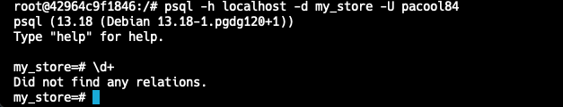
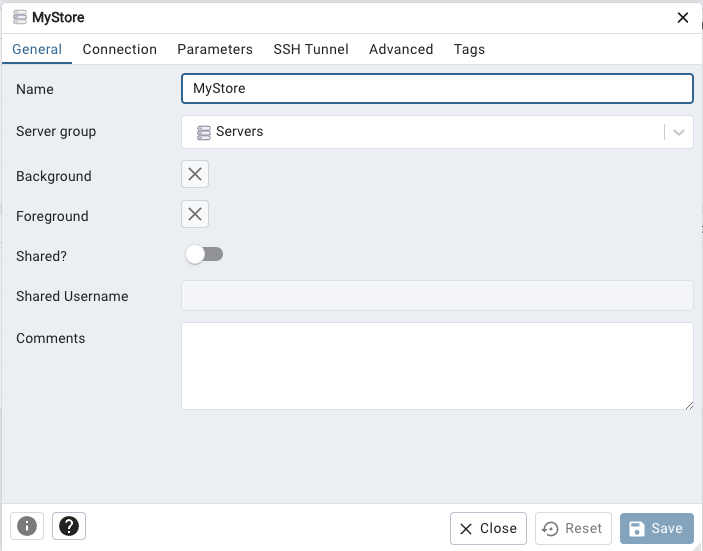
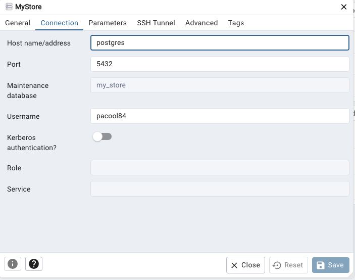

# Proyecto de Base de Datos con Docker y PostgreSQL

Este proyecto utiliza Docker para configurar y ejecutar un contenedor con una base de datos PostgreSQL. A continuación, se detallan los pasos para crear, ejecutar, validar y finalizar el contenedor, así como para conectarse al servidor de base de datos.

## Configuración y Ejecución del Contenedor

Para crear y ejecutar el contenedor en Docker con la base de datos PostgreSQL, ejecuta el siguiente comando:

```sh
docker compose up -d postgres
```

La parte de `postgres` en el comando es la referencia al nombre del servicio definido en el archivo `docker-compose.yml`.

## Validación del Contenedor

Para validar que el contenedor se está ejecutando correctamente, utiliza el siguiente comando:

```sh
docker compose ps
```

Este comando mostrará el estado de los servicios definidos en el archivo `docker-compose.yml`.

## Finalización del Contenedor

Si necesitas finalizar la ejecución del contenedor, utiliza el siguiente comando:

```sh
docker compose down
```

Este comando detendrá y eliminará los contenedores, redes y volúmenes creados por `docker compose up`.

## Conexión al Servidor de Base de Datos

Para conectarte al servidor de base de datos que se está ejecutando en el contenedor de Docker, utiliza el siguiente comando:

```sh
docker compose exec postgres bash
```

Este comando abrirá una terminal dentro del contenedor `postgres`, permitiéndote interactuar con el servidor de base de datos PostgreSQL.

- Para poder conectarse a la base de datos de postgres se debe de utilizar el comando:

```sh
psql -h localhost -d my_store -U my_user
```

La parte de `my_user` en el comando hace referencia al usuario que configuró en el archivo `docker-compose.yml`.



## Configuración de PGADMIN

PGADMIN es una herramienta de administración y desarrollo para PostgreSQL, que proporciona una interfaz gráfica para gestionar bases de datos PostgreSQL.

Para agregar la configuración de PGADMIN como servicio en nuestro archivo `docker-compose.yml`, sigue las instrucciones a continuación:

- Se agrega la configuración de PGADMIN como servicio a nuestro archivo `docker-compose.yml`, como se muestra a continuación:

```yaml
services:
  pgadmin:
    image: dpage/pgadmin4
    environment:
      PGADMIN_DEFAULT_EMAIL: admin@example.com
      PGADMIN_DEFAULT_PASSWORD: admin
    ports:
      - "5050:80"
```

Este servicio permitirá acceder a PGADMIN a través del navegador web en la dirección `http://localhost:5050`, utilizando las credenciales configuradas en las variables de entorno `PGADMIN_DEFAULT_EMAIL` y `PGADMIN_DEFAULT_PASSWORD`.

- Para levantar el servicio de PGADMIN en un contenedor se debe de ejecutar el siguiente comando:

```sh
docker compose up -d pgadmin
```

- Una vez que se haya generado el contenedor para el servicio de PGADMIN es necesario conectarse a la URL que se mencionó anteriormente dentro de nuestro "localhost", ingresaremos las credenciales apropiadas y comenzaremos a realizar la conexión al servidor como se muestra en las siguientes imágenes:





//
